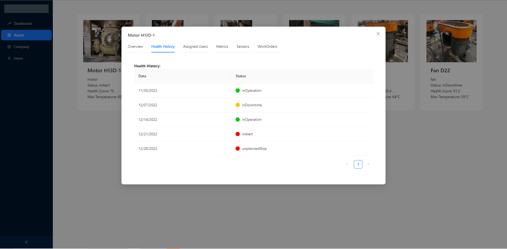
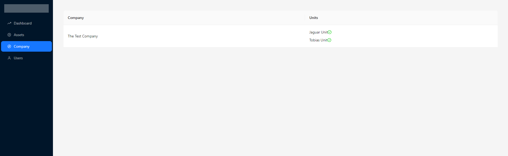
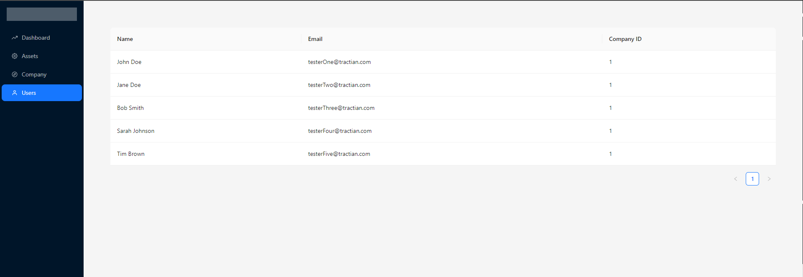

# Tractian Frontend Engineer Challenge

## Installation

```bash
git clone https://github.com/vitor-ramalho/tractian_frontend.git

cd tractian_frontend

yarn

```

## Usage

```bash
yarn dev
```

## Interface

### Homepage (Dashboard)


### Assets List




### Company list



### User List



## License

[MIT](https://choosealicense.com/licenses/mit/)
